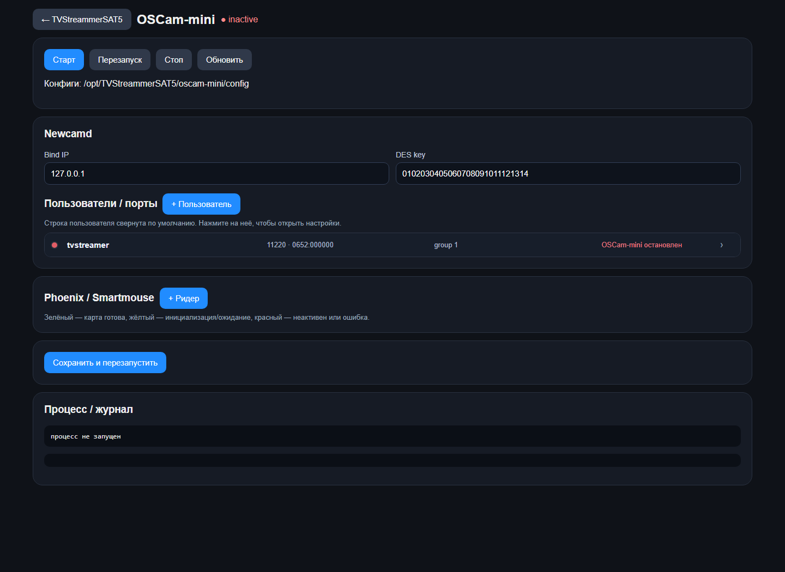

# TVStreammerSAT5

**Версия: 202.8**

TVStreammerSAT5 - сервер маршрутизации, мониторинга и преобразования телевизионных потоков на базе C++17 и GStreamer. Программа принимает сетевые и спутниковые источники, формирует один или несколько выходов для каждого канала и управляется через встроенную русско-английскую веб-панель.




## Возможности

- создание, редактирование, запуск, остановка и удаление потоков из браузера;
- основной и резервный источник с автоматическим переключением и возвратом;
- несколько независимых выходов у одного потока;
- MPEG-TS passthrough или транскодирование видео и аудио;
- CBR/VBR-формирование транспортного потока, контроль PCR и continuity counter;
- переназначение SID, video/audio PID, Service Name и Provider;
- DVB-S/S2 сканирование с выбором адаптера, frontend, транспондера и сервисов;
- совместное использование одного DVB frontend каналами одного транспондера;
- работа с FTA и локальной Conditional Access через CA-плагин и OSCam-mini;
- мониторинг входного/выходного битрейта, ошибок, DVB signal/quality и загрузки интерфейсов;
- список абонентов, фильтрация по IP и отображение активных сессий;
- Telegram-уведомления о состоянии потоков;
- встроенный тестовый источник и библиотека файлов замены;
- Basic Authentication и шифрование пароля панели в конфигурации.

## Поддерживаемые протоколы

### Входы

| Источник | Примеры и режимы |
| --- | --- |
| UDP MPEG-TS | unicast, multicast, выбор входного интерфейса |
| RTP MPEG-TS | unicast и multicast |
| SRT | Caller и Listener |
| HTTP MPEG-TS | одиночный поток по HTTP/HTTPS |
| HLS | master/media playlist, сегменты, Header или Query access key |
| RTSP | сетевые камеры и медиасерверы |
| RTMP | RTMP-источники |
| Файл | локальный файл, в том числе файл замены с циклическим воспроизведением |
| DVB-S/S2 | Linux DVB frontend через `dvbsrc` |
| Тестовый сигнал | встроенный `test://bars` |

### Выходы

| Выход | Назначение |
| --- | --- |
| UDP MPEG-TS VBR | передача исходного транспортного потока |
| UDP MPEG-TS CBR | транспортный поток с заданным целевым битрейтом |
| RTP MPEG-TS | доставка MPEG-TS поверх RTP |
| SRT | Caller или Listener |
| HTTP TS | непрерывный MPEG-TS по HTTP |
| HLS | live playlist и MPEG-TS сегменты |
| RTSP Push | публикация на внешний RTSP-сервер |
| RTMP Push | публикация на RTMP-сервер или YouTube |

Для одного канала можно настроить основной и дополнительные выходы разных типов.

## Веб-панель

После запуска панель доступна по адресу:

```text
http://SERVER_IP:9000/
```

Начальные учётные данные при первом запуске:

```text
login: admin
password: admin
```

Сразу измените пароль в настройках. Он хранится в `tvstreammersat5-config.json` в зашифрованном виде AES-256-GCM, а локальный ключ создаётся рядом с конфигурацией в файле `tvstreammersat5-ui.key` с правами `0600`.

Основная панель показывает карточки каналов, состояние источника, активный вход, битрейт, режим выхода, ошибки MPEG-TS, DVB-метрики и состояние декодирования. Настройки программы, абоненты, CA-клиенты и окно «О программе» доступны из верхней панели.

## DVB-S/S2

Диалог добавления спутниковых каналов поддерживает:

- выбор `/dev/dvb/adapterN/frontendN`;
- DVB-S и DVB-S2;
- частоту, symbol rate, поляризацию, FEC и модуляцию;
- DiSEqC и параметры LNB LOF;
- DVB-S2 stream ID;
- просмотр LOCK, signal и quality;
- сканирование PAT/PMT/SDT и выбор найденных сервисов;
- автоматическое сохранение SID, PMT, PCR и elementary PID.

Каналы одного транспондера могут использовать общий физический frontend. Для одновременного приёма другого транспондера требуется другой frontend или остановка текущих каналов на этом устройстве.

Пользователь процесса должен иметь доступ на чтение и запись к `/dev/dvb/*`.

## Conditional Access и OSCam-mini

Проект включает:

- версионированный in-process `CaBackend` ABI;
- плагин `tvstreammersat5-ca-newcamd.so`;
- обнаружение Phoenix/SmartMouse USB reader;
- привязку зашифрованного канала к конкретному CA-клиенту;
- ограничения количества сервисов и состояние декодирования в карточке канала;
- vendored OSCam-mini с Newcamd, Irdeto, Viaccess и Phoenix.

OSCam-mini собирается общей целью CMake и управляется на странице:

```text
http://SERVER_IP:9000/oscam-mini
```

Подробная настройка описана в [OSCAM_MINI.md](OSCAM_MINI.md). Интерфейс плагина описан в [docs/CA_BACKEND_PLUGIN_API.md](docs/CA_BACKEND_PLUGIN_API.md), транспорт Phoenix - в [docs/PHOENIX_SERIAL_TRANSPORT.md](docs/PHOENIX_SERIAL_TRANSPORT.md).

Используйте Conditional Access только с оборудованием, картами и сервисами, для которых у вас есть законные права доступа.

## Системные требования

- Ubuntu 24.04 или совместимая Debian/Ubuntu система;
- CMake 3.10 или новее;
- компилятор с поддержкой C++17;
- GStreamer 1.0 и наборы Base/Good/Bad/Ugly/Libav;
- Boost Thread/System, JsonCpp, libcurl, OpenSSL и libdvbcsa;
- Linux DVB и Phoenix/SmartMouse устройства - только для соответствующих функций.

## Сборка

Установите зависимости:

```bash
chmod +x install_deps.sh
sudo ./install_deps.sh
```

Соберите приложение, Newcamd CA-плагин и OSCam-mini:

```bash
cmake -S . -B build -DCMAKE_BUILD_TYPE=Release
cmake --build build --parallel
```

Основные артефакты:

```text
build/TVStreammerSAT5
build/tvstreammersat5-ca-newcamd.so
build/oscam-mini/oscam-mini
```

## Запуск

Программа читает конфигурацию из текущего рабочего каталога. При первом запуске она создаётся автоматически.

```bash
mkdir -p ~/tvstreammersat5-data
cd ~/tvstreammersat5-data
/path/to/project/build/TVStreammerSAT5
```

В журнале появится адрес HTTP-порта, по умолчанию `9000`. Для остановки используйте `Ctrl+C` или штатное управление сервисом.

Установка собранных компонентов:

```bash
sudo cmake --install build
```

## Конфигурационные файлы

Все изменяемые данные находятся в рабочем каталоге процесса:

```text
tvstreammersat5-config.json       основные настройки и потоки
tvstreammersat5-ui.key            ключ шифрования пароля панели
tvstreammersat5-subscribers.json  абоненты и IP-фильтрация
backup-files/                     загруженные файлы замены
```

Перед обновлением сохраняйте эти файлы. Не публикуйте конфигурацию: она может содержать сетевые адреса, Telegram token и параметры CA-клиентов.

## Docker

Соберите образ:

```bash
docker build --pull -t tvstreammersat5:202.8 .
```

Для запуска подготовьте `tvstreammersat5-config.json`, затем выполните:

```bash
IMAGE_NAME=tvstreammersat5:202.8 ./scripts/run_container.sh
```

Скрипт использует host networking, подключает каталог конфигурации и автоматически передаёт найденные `/dev/dvb` устройства в контейнер.

## Проверка и диагностика

Проверка HTTP-сервера без авторизации:

```bash
curl http://127.0.0.1:9000/health
```

Проверка GStreamer:

```bash
./scripts/check_transcoder_plugins.sh
gst-inspect-1.0 dvbsrc
gst-inspect-1.0 mpegtsmux
```

Для подробного журнала GStreamer:

```bash
GST_DEBUG=2 ./build/TVStreammerSAT5
```

Если DVB frontend занят, проверьте другие процессы и убедитесь, что каналы на одном физическом frontend настроены на один транспондер. Если нет транскодирования, запустите `scripts/check_transcoder_plugins.sh` и проверьте наличие подходящих видео- и аудиоэнкодеров.

## Лицензии сторонних компонентов

Исходники OSCam-mini находятся в `third_party/oscam-mini` вместе с собственными файлами лицензии и сведениями об upstream revision. Лицензии остальных библиотек определяются установленными системными пакетами.

## Контакты

Поддержка: [monkipnet@gmail.com](mailto:monkipnet@gmail.com)
